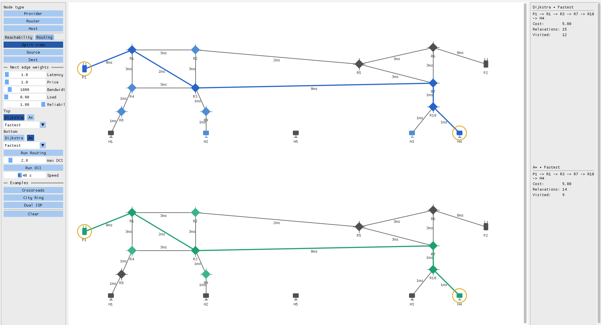

# Network Analysis Lab

Interactive tool for building and analyzing computer networks, with step-by-step algorithm animations and a split-canvas comparator. Built around two independent analysis domains — **reachability** and **routing** — each with its own algorithm analysis and visualization.



**Tech focus:**  
C++17 • Dear ImGui • GLFW • OpenGL3 • CMake

**Algorithm focus:**  
Multi-source BFS • Connectivity Criticality • Tarjan's Bridge Detection • Dijkstra • A* • Detour Cost Index (DCI)

## Features

**Reachability domain**
- **Multi-source BFS** — simultaneous propagation from all providers; classifies hosts as reachable, underserved, or unreachable
- **Connectivity Criticality** — three-level edge classification (critical / semi-critical / redundant) built on top of Tarjan's bridge detection
- **Step-by-step animation** — BFS wave and bridge criticality animated level by level with provider-colored subtrees

**Routing domain**
- **Dijkstra and A*** — shortest-path algorithms across five configurable cost metrics
- **Split canvas** — run two algorithm/metric combinations side by side on the same graph for direct comparison
- **Detour Cost Index (DCI)** — per-edge resilience metric that quantifies how much worse the best alternative path is if that edge fails
- **Packet animation** — packet travels along the found path after routing completes
- **Edge tooltip** — hover any edge in routing mode to inspect all five properties: latency, price, bandwidth, load, reliability

**Graph editor**
- Place and connect providers, routers, and hosts with full per-edge weight control
- Three built-in example networks: Crossroads, City Ring, Dual ISP

---

## Reachability Analysis

### BFS

Multi-source BFS launches simultaneously from all providers and classifies each host by distance:

- **Reachable** — connected to at least one provider within the hop limit
- **Underserved** — reachable, but path length exceeds the configured maximum
- **Unreachable** — no path to any provider exists

The animation propagates the BFS wave level by level, coloring each provider's subtree distinctly. Routers remain neutral gray as shared infrastructure.

### Connectivity Criticality

Each edge is classified by how much its removal degrades connectivity — not just whether it's a bridge. Tarjan's DFS-based bridge detection identifies bridges, then a second pass simulates removal of every edge to detect edges that, while not necessarily bridges themselves, would expose new ones.

**Critical** — removal immediately disconnects at least one host from all providers. These edges are *bridges* and are the network's hard breakpoints. 

**Semi-critical** — removal doesn't break connectivity immediately, but creates new critical bridges elsewhere. The network survives but becomes more fragile.

**Redundant** — removal has no effect on the critical structure. Equally resilient without it.

This gives operators a clear priority order: harden Critical edges first, protect Semi-critical ones second, treat Redundant ones as safely cuttable.

---

## Routing Analysis

### Dijkstra and A*

Finds the optimal path between a selected source and destination across five cost metrics.

- **Dijkstra** — exhaustive shortest-path; explores all reachable nodes ordered by accumulated cost
- __A*__ — heuristic-guided search; visits fewer nodes than Dijkstra on geometrically favorable graphs while still guaranteeing the optimal path.

> **Admissible heuristic.** An admissible heuristic is one that never overestimates the true cost to the goal — it may underestimate, but never overestimate. A* is only guaranteed to find the optimal path when this holds.
>
> Each edge has a screen length (distance between its two node centers) and a metric cost (latency, price, etc.). Their ratio `cost / length` gives cost per pixel for that edge. Taking the minimum across all edges gives `r` — the lowest cost-per-pixel in the graph.
>
> The heuristic is then `h(n, goal) = r × d(n, goal)`, where `d` is the straight-line distance between node centers.
>
> **Why it never overestimates:** every edge costs at least `r × its length` (since `r` is the minimum ratio), so any path costs at least `r × sum of its edge lengths`. The sum of edge lengths along any path is always ≥ the straight-line distance (triangle inequality). Therefore:
>
> `true cost ≥ r × d(n, goal) = h(n, goal)`
>
> Admissibility holds for every metric and every graph topology.

**Metrics:**

| Metric | Edge weight                                               |
|---|-----------------------------------------------------------|
| Fastest | Latency (ms)                                              |
| Cheapest | Price                                                     |
| Least Loaded | Current load (0–1)                                        |
| Most Reliable | `-log(reliability)` — see note*                           |
| Balanced | `0.4 * latency + 0.4 * price + 0.2 * (-log(reliability))` |

> \* Shortest-path algorithms minimize additive costs, but reliability is multiplicative — the reliability of a path is the product of its edge reliabilities. Taking `-log(r)` converts that product into a sum: minimizing `Σ -log(rᵢ)` is equivalent to maximizing `Π rᵢ`, the total path reliability. This makes reliability composable with Dijkstra and A\* without any special treatment.

The split canvas runs two independent configurations simultaneously — different algorithm, metric, or both — on the same graph. Each canvas shows metric labels on edges, its own path animation, and its own stats panel (path, total cost, relaxation count, visited node count).

### Detour Cost Index (DCI)

DCI answers: *if this path edge failed, how much worse would the best alternative be?*

For each edge on the found path, DCI removes it temporarily and re-runs routing. The result is a cost ratio:

```
DCI(e) = cost_without_e / cost_with_e
```

A DCI ratio of 1.0 means a same-cost alternative exists. A ratio of 2.0 means the detour costs twice as much. Infinity means no alternative path exists at all.

Each path edge is classified against a configurable DCI ratio threshold (default 2.0):

**Bridge** — no detour exists. If this edge fails, the destination becomes unreachable. Routing-layer single point of failure.

**Critical** — DCI ≥ threshold. The detour costs at least as much more as the threshold dictates. Loss of this edge causes major service degradation.

**Semi-critical** — DCI between 1 and the threshold. A worse but usable alternative exists. Worth monitoring.

**Redundant** — DCI close to 1. A near-equivalent alternative path exists. Edge loss has negligible routing impact.

DCI requires a successful routing result and is computed independently for each canvas.

---

## Build

**Requirements:** C++ compiler with C++17 support, CMake 3.16 or newer, OpenGL (system-provided). GLFW and Dear ImGui are fetched automatically via CMake FetchContent.

```bash
git clone git@github.com:andja45/network-analysis-lab.git
cd network-reachability-analysis
```

GUI application:
```bash
cmake -B build -DBUILD_GUI=ON
cmake --build build --target gui_app
./build/gui/gui_app
```

CLI demo:
```bash
cmake -B build
cmake --build build --target core_demo
./build/core/core_demo
```

---

## Usage

### Canvas

| Action | Result |
|---|---|
| Select node type (left panel), then left-click empty space | Place a node |
| Left-click a node, then left-click another node | Connect them with an edge |
| Left-click and drag a node | Move it |
| Right-click a node | Delete node and all its edges |
| Right-click an edge | Delete that edge |
| Hover an edge (Routing mode) | Show all five edge properties |

Deleting any node or edge clears the current analysis — re-run when ready.

### Controls (left panel)

**Node tools**
- **Provider / Router / Host** — select node type for placement; click again to deselect

**Reachability tab**
- **Run BFS** — run reachability analysis and animate the BFS wave
- **Run Bridge Detection** — classify all connections and animate the result
- **Max hops** — threshold for underserved classification; `-1` means unlimited

**Routing tab**
- **Split view** — split the canvas into two independent routing canvases
- **Source / Dest** — click to arm, then click a node on the canvas to set it
- **Next edge weights** — latency, price, bandwidth, load, reliability applied to the next drawn edge
- **Top / Bottom** — per-canvas algorithm (Dijkstra or A*) and metric selection
- **Run Routing** — compute and animate the path on both canvases
- **Max DCI** — threshold for edge classification; `2.0` is default
- **Run DCI** — compute Detour Cost Index for the current routing result

**Global**
- **Speed** — animation step delay
- **Crossroads / City Ring / Dual ISP** — load a built-in example network
- **Clear** — reset the canvas

### Reading the results (right panel)

**BFS view** — total, reachable, unreachable, and underserved host counts with per-host detail.

**Bridge view** — edge counts by criticality and a list of each critical and semi-critical connection.

**Routing view** — per-canvas: found path, total cost, relaxation count, visited node count, and DCI table once computed.

### Color reference

| Color | Meaning |
|---|---|
| Node color (BFS) | Nearest provider |
| Gray node | Router (shared infrastructure) |
| Orange node | Underserved host |
| Red node | Unreachable host |
| Red edge (criticality) | Critical connection |
| Orange edge (criticality) | Semi-critical connection |
| Green edge (criticality) | Redundant connection |
| Blue edge (routing) | Dijkstra path |
| Purple edge (routing) | A* path |
| Red edge (DCI) | Bridge — no alternative path |
| Orange edge (DCI) | Critical or semi-critical detour |
| Green edge (DCI) | Redundant — free alternative exists |
